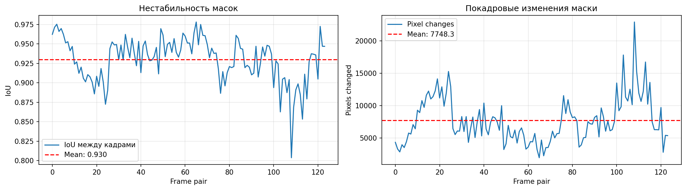
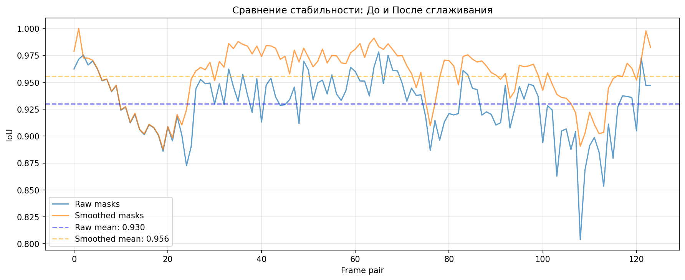
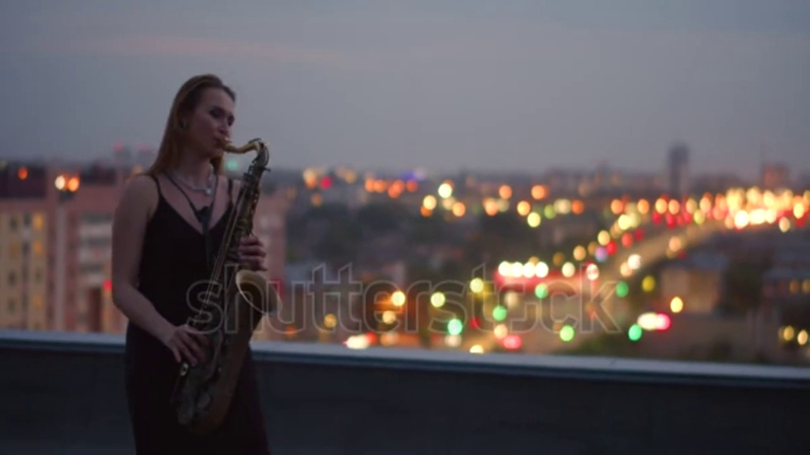
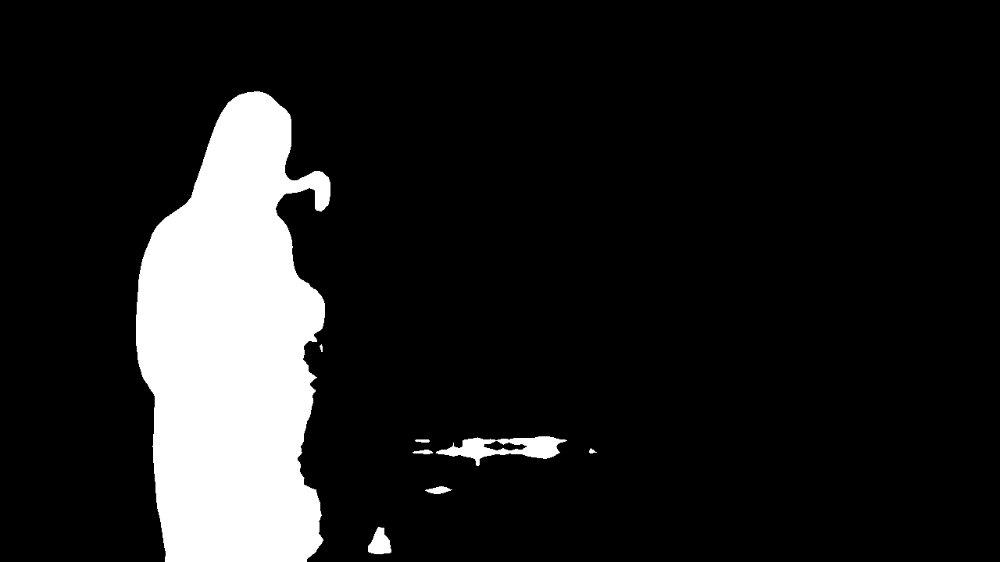
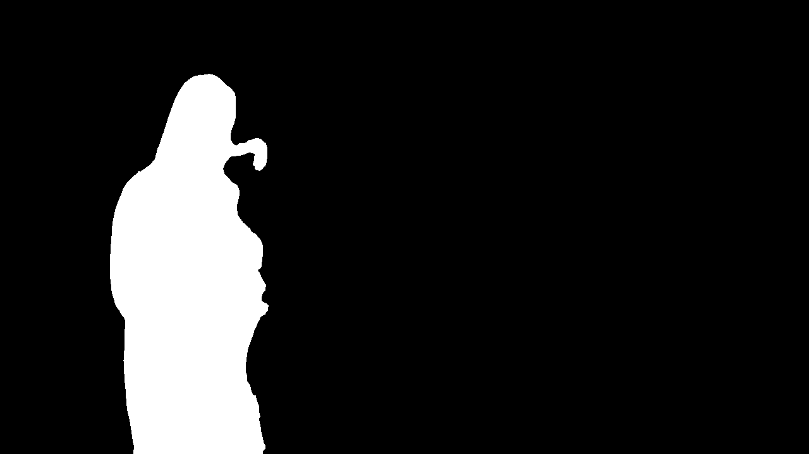
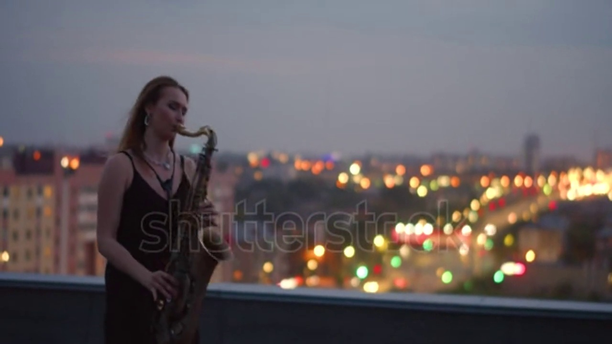
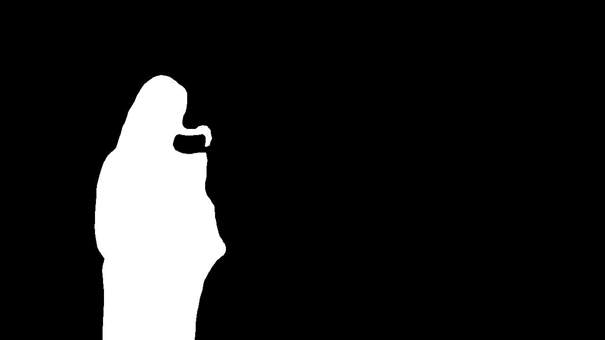
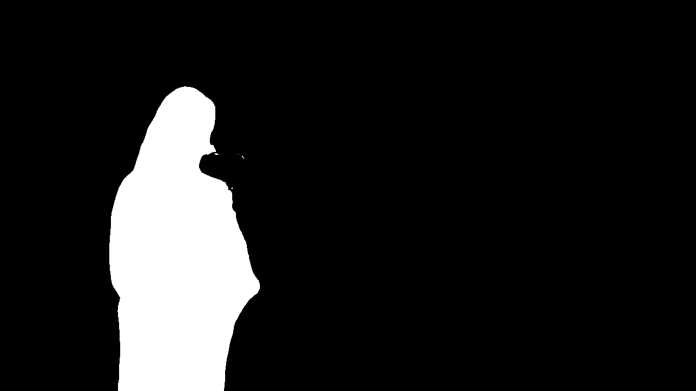
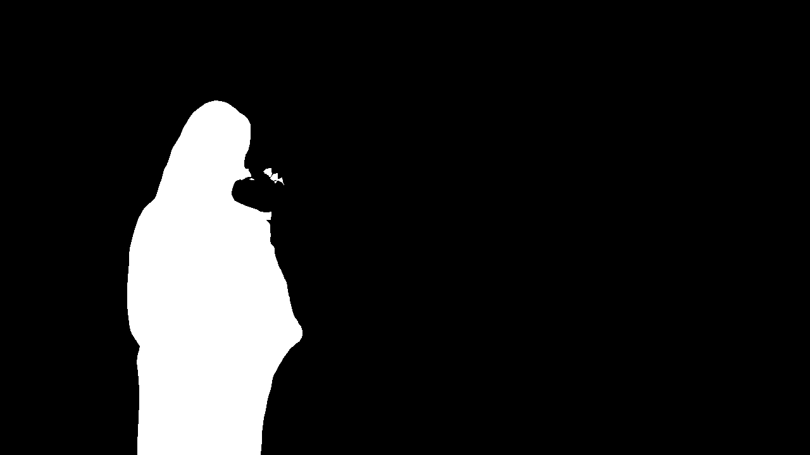

# Mask smoothing

## Описание проекта

Проект реализует метод стабилизации масок видеопоследовательности при семантической сегментации. При обработке видео поэлементно модели глубокого обучения генерируют маски, которые имеют временную нестабильность: соседние кадры дают различные предсказания для одного и того же объекта, даже если сцена остаётся статичной.

Решение применяет гауссово временное сглаживание к последовательности масок. Алгоритм использует взвешенное усреднение соседних кадров с весами, убывающими по нормальному распределению. Это обеспечивает:

- Плавные переходы между кадрами без резких скачков
- Сохранение уверенных предсказаний модели в центральном кадре окна

Cегментация выполняется моделью DeepLabV3 с бэкбоном ResNet-50
Видео для тестирования скачать [тут](https://disk.360.yandex.ru/i/zROVp4IoKyADQg)
## Setup

```bash
# Создание виртуального окружения Python 3.11
uv venv seg --python 3.11

source seg/bin/activate

uv pip install -r requirements.txt

pre-commit install
pre-commit run --all

cd src/
python main.py # точка входа
```

### Структура проекта после инициализации

После запуска `python main.py` создаются следующие директории:

```
output/
├── frames_extracted/        # Извлечённые кадры из видео
├── masks_raw/               # Сегментационные маски от DeepLabV3
├── masks_smoothed/          # Маски после гауссова сглаживания
├── analysis/                # Графики анализа стабильности
└── videos/                  # Итоговое видео с наложением масок
```

## Обоснование выбора метода

На графике показано, что коэффициент пересечения IoU между соседними кадрами варьируется в диапазоне 0.85-0.97, а количество изменённых пикселей может резко скачкообразно меняться. Это указывает на то, что модель генерирует недостаточно когерентные предсказания при обработке последовательности.

Гауссово временное сглаживание выбрано как оптимальный компромисс между следующими критериями:

1. Гауссова весовая функция обеспечивает плавное взвешивание соседних кадров, давая наибольший вес центральному кадру и экспоненциально убывающий вес удалённым. Это приводит к естественным переходам между кадрами и сохранению изменений с центрального кадра.
2. В примере видео модель сильно уверена в предсказаниях, она ошибается в определении границ девушки и муз инструмента. эта граница резко гуляет во времени, по экспериментам гауссовый метод сглаживает и удаляет шумовые фрагменты маски, вероятностный метод не даст прироста, так как предсказания имеют высокий скор.

### Ограничения метода

Метод эффективен для случаев, когда:

- Когда появляется рандомный шум на кадрах
- Когда границы резко гуляют, а объект сегментации не резко перемещается

Метод неэффективен для случаев, когда:

- Модель систематически ошибается на определённых объектах
- Необходимо отслеживать быстрые изменения объектов (большие окна вводят задержку)

## Визуализация

### Метрики стабильности масок

Для оценки эффективности сглаживания используются две основные метрики:

#### IoU (Intersection over Union) между соседними кадрами

IoU измеряет долю совпадения масок двух соседних кадров относительно их объединения:

Значение близко к 1 означает, что соседние кадры имеют очень похожие маски. Значения ниже указывают на изменение масок между кадрами, что воспринимается как мерцание.

#### Изменение в пикселях

Этот показатель считает количество пикселей, которые изменили значение (с фона на объект или наоборот) между соседними кадрами:

Большие значения означают, что маска сильно отличается от предыдущего кадра. Резкие всплески на графике могут указывать как на реальное движение объектов, так и на нестабильность предсказаний модели.

### Анализ до применения сглаживания

На левом графике показана нестабильность сырых масок. IoU колеблется около значения 0.930, что означает среднюю когерентность. Видны явные всплески вверх и спады, особенно после кадра 100, где IoU падает до 0.87. Это свидетельствует о том, что исходные предсказания модели содержат значительное временное шумы.

На правом графике видно, что количество изменённых пикселей варьируется от 2000 до 15000 пикселей на пару кадров. Высокая волатильность (заметные скачки) указывает на нестабильную сегментацию.



### Сравнение до и после сглаживания

На нижнем графике наложены две кривые:

- Синяя линия (Raw masks): исходный IoU. Среднее значение 0.930.
- Оранжевая линия (Smoothed masks): IoU после применения гауссова сглаживания. Среднее значение 0.956.

Гауссово сглаживание одновременно:

- Увеличивает среднее IoU на 3 %
- Маски становятся более стабильными от кадра к кадру



### Визуализация сравнения подходов сглаживания

<table>
  <tr>
    <th width="25%">Исходный кадр</th>
    <th width="25%">Сырая маска</th>
    <th width="25%">Гауссово сглаживание</th>
    <th width="25%">Медианное сглаживание</th>
  </tr>
  <tr>
    <td align="center">
      
    <td align="center">
      
    <td align="center">
      
    <td align="center">
      
  </tr>
  <td align="center">
      
    <td align="center">
      
    <td align="center">
      
    <td align="center">
      
  </tr>
</table>
Таблица выше показывает удачные и неудачные кейсы применения смуфинга.
